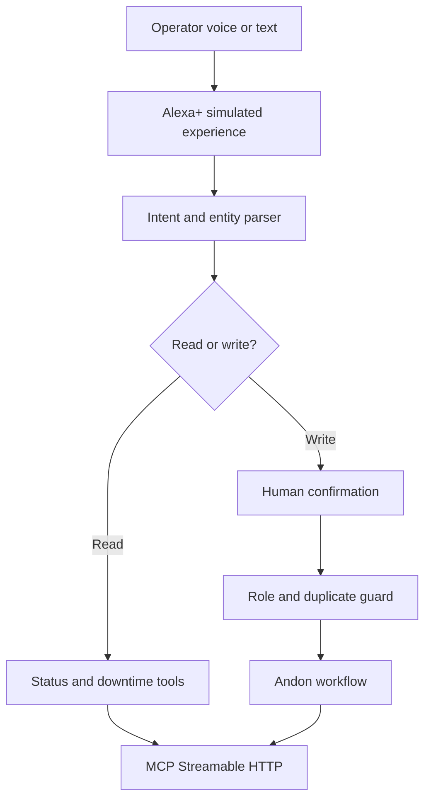

# AndonVoice AI

> Alexa+ and MCP-powered manufacturing incident response with human confirmation, role controls, and traceable Andon workflows.

AndonVoice AI is the open-source hackathon edition of a real shop-floor Andon system. It turns natural-language operator requests into safe, structured actions while keeping people responsible for every operational write.

## Why it matters

During a line stop, operators should not have to navigate several screens before the right responder knows what happened. AndonVoice accepts voice or text such as:

> Report machine breakdown on line HLA-A, line stop.

It identifies the line and category, shows the intended action, and waits for explicit confirmation. Ambiguous lines are rejected and an active incident with the same line/category triggers the duplicate-call interlock.

## Hackathon track

- **Primary:** Alexa+
- **Experience:** simulated Alexa+ web experience plus a self-hosted MCP server
- **MCP transport:** stateless Streamable HTTP at `POST /mcp`
- **Protocol target:** `2025-11-25`
- **Optional mini challenge:** AWS Builder through the Bedrock analysis adapter planned for v0.3

## Working features

- Visual operator, responder, administration, analytics, and plant-map surfaces
- Alexa+ simulated voice/text experience
- Browser speech recognition when supported
- Natural-language intent parsing for create, list, and downtime requests
- Human confirmation before write actions
- Duplicate active-call interlock and role-controlled closure
- Four MCP tools exposed over Streamable HTTP
- Firebase production adapter and self-contained demo mode
- Audit trail, Telegram notifications, master-data import/export, and bilingual UI

## MCP tools

| Tool | Mode | Safety rule |
| --- | --- | --- |
| `create_andon_call` | Write | `confirmed: true` required; duplicate active calls rejected |
| `list_active_calls` | Read | May be filtered by production line |
| `get_downtime_summary` | Read | Returns active stops and longest duration |
| `update_incident_status` | Write | Confirmation required; closure restricted by role |

## Quick start

Requirements: Node.js 20 or later.

```bash
npm install
npm run dev
```

Open `http://localhost:3000`. Without Firebase variables, the app automatically uses demo mode and fictional production lines.

| Role | Badge | PIN |
| --- | --- | --- |
| Operator | `OP-1001` | `1234` |
| Leader | `LEADER-2001` | `2345` |
| Supervisor | `SPV-3001` | `3456` |
| Manager | `MGR-4001` | `4567` |
| Admin | `admin01` | `8888` |

## Verify

```bash
npm run lint
npm test
npm run build
```

MCP initialize smoke test:

```bash
curl -X POST http://localhost:3000/mcp \
  -H "Content-Type: application/json" \
  -H "Accept: application/json, text/event-stream" \
  -H "MCP-Protocol-Version: 2025-11-25" \
  --data '{"jsonrpc":"2.0","id":1,"method":"initialize","params":{"protocolVersion":"2025-11-25","capabilities":{},"clientInfo":{"name":"demo","version":"1.0.0"}}}'
```

## Architecture



## Safety design

- AI cannot silently create or close incidents.
- Missing production-line context blocks creation.
- Duplicate active calls are rejected.
- Only supervisor, manager, or admin roles may close an MCP incident.
- The hackathon demo contains fictional production lines and no employer data.
- This prototype is not a certified safety system and must not replace emergency controls.

## Roadmap

- v0.1 — Alexa+ simulator, command parser, MCP tools, safety controls
- v0.2 — shared persistence between web UI and MCP, richer confirmation context
- v0.3 — Amazon Bedrock 4M1E analysis adapter and evaluation suite
- v1.0 — English demo video, deployment guide, final Devpost submission

## License

Apache-2.0. See [LICENSE](LICENSE).

Copyright 2026 Ressa Hidayat / After Project.
