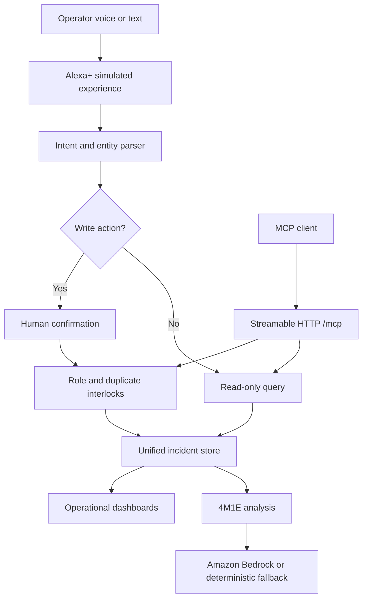

# AndonVoice AI Architecture

The web UI, REST adapter, and MCP tools share the server incident store. The browser polls every two seconds in demo mode and falls back to local storage for static-only hosting.

## Trust boundaries

- Natural language is untrusted input and never directly changes operational state.
- Write tools require explicit confirmation fields.
- Duplicate active incidents are rejected by line and category.
- Production mode can require a timing-safe compared bearer token.
- Bedrock output is decision support; deterministic safety wording cannot be removed by model output.
- Persistence is opt-in through `INCIDENT_STORE_FILE`; secrets remain runtime environment variables.

## MCP surface

`POST /mcp` implements stateless Streamable HTTP. Tools: `create_andon_call`, `list_active_calls`, `get_downtime_summary`, `update_incident_status`, and `analyze_incident_4m1e`.
